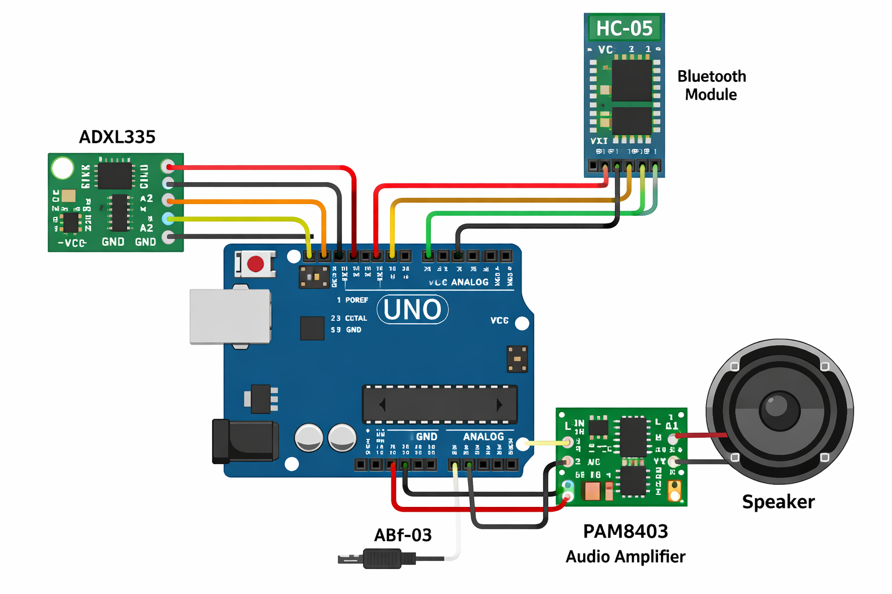

#  Gesture Controlled Media System using Arduino

##  Overview

This project implements a **gesture-controlled media system** using an Arduino and Bluetooth communication. Hand gestures are detected using an accelerometer and translated into media control commands such as play/pause, next track, and volume control on a connected laptop. Commands are transmitted via Bluetooth and interpreted on a laptop using Python to control media playback.

The system demonstrates **embedded systems, sensor integration, and software automation** working together in a complete pipeline.


##  Components Used

* Arduino Uno 
* ADXL335 Accelerometer
* HC-05 Bluetooth Module
* PAM8403 Audio Amplifier
* Speaker
* Breadboard
* Jumper Wires


## Circuit Diagram

The diagram shows the connection between the ADXL335 accelerometer, Arduino board, HC-05 Bluetooth module, and PAM8403 amplifier. The Arduino processes gesture inputs and transmits commands via Bluetooth to a laptop for media control.


##  System Architecture

```text
ADXL335 → Arduino → HC-05 → Python Script → Laptop Media Control
```

### Workflow:

1. Accelerometer captures hand movement (X, Y, Z axes)
2. Arduino processes analog values and detects gestures
3. Commands are sent via Bluetooth (HC-05)
4. Python script receives commands and simulates key presses
5. Laptop media (YouTube, Spotify, etc.) is controlled


##  Software Components

### 🔹 Arduino (`gesture.ino`)

* Reads accelerometer data
* Applies threshold-based gesture detection
* Sends commands via Bluetooth

### 🔹 Python (`controller.py`)

* Reads serial data from HC-05
* Uses `pyautogui` to simulate keyboard actions
* Controls media playback on laptop


##  How to Run

### 1. Upload Arduino Code

* Open `gesture.ino` in Arduino IDE
* Select correct board (Uno)
* Upload code

### 2. Connect Bluetooth

* Pair HC-05 with your laptop
* Note the COM port (e.g., COM3)

### 3. Install Python Dependencies

```bash
pip install pyserial pyautogui
```

### 4. Run Python Script

```bash
python controller.py
```

---

##  Supported Gestures

| Gesture Condition | Action       |
| ----------------- | ------------ |
| Tilt Left/Right   | Play / Pause |
| Tilt Forward      | Next Track   |
| Tilt Up           | Volume Up    |
| Tilt Down         | Volume Down  |

---

##  Features

* Gesture-based media control
* Wireless communication using Bluetooth
* Real-time sensor data processing
* Integration of hardware + software


##  Limitations

### 1. No Bluetooth Audio Streaming

The HC-05 module is designed for **serial communication only** and does not support audio streaming.

* Music cannot be played directly from a phone to the speaker
* The system controls media on a laptop instead


### 2. Limited Gesture Accuracy

* ADXL335 outputs raw analog values
* No advanced filtering or calibration
* Complex gestures may not be detected reliably


### 3. Dependency on Active Application

* Media control depends on which application is active (YouTube, VLC, etc.)
* Behavior may vary across systems


### 4. Partial Hardware Utilization

* PAM8403 amplifier is not directly controlled by Arduino
* It only amplifies external audio input


##  Key Learnings

* Handling noisy sensor data in embedded systems
* Importance of filtering and calibration
* Serial communication using Bluetooth modules
* Integration of Arduino with Python for real-world control
* System-level thinking (hardware + software interaction)


##  Future Improvements

* Replace ADXL335 with MPU6050 (better accuracy)
* Implement filtering techniques (moving average / Kalman filter)
* Add machine learning-based gesture recognition
* Use Bluetooth audio module for real speaker functionality
* Build a dedicated desktop/mobile app for control


##  Note

This project was developed as a self-learning initiative to explore gesture-based interaction and embedded system design. It reflects both implementation and real-world limitations of low-cost hardware components.
